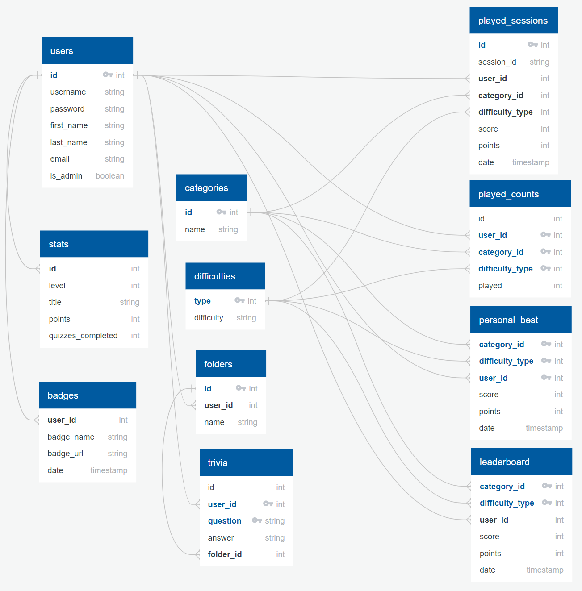

# Trivia Guru
[Check it out here!](https://triviaguru.surge.sh/)

#### Introduction

Trivia Guru is dedicated to people who would like to broaden their knowledge on a specific topic while having fun at the same time.

This website utilized resources from Open Trivia DB which offers over 4000 trivia questions in over 10 categories! This offsite offers tools that can track your statistics, personal best scores and recent played sessions in each category and difficulty.

The tech stack of this project consists of 
- Frontend - React, Reactstrap, Bootstrap, Noty
- Backend - NodeJS, PostgreSQL, Json Web Token, Bcrypt, Moment, Json Schema, Nock

#### Database Schema

#### Functionality

* Both registered and non-registered users can do the trivia quizzes and get a score at the end based on the number of correct answers, the time which takes the user to answer the question, and the maximum combo which user answers correctly in a roll
* Registered users can track their statistics, session record, personal best scores 
* Registered users can save any trivia to favourites
* Registered users can create folders and categorize their favorite trivia
* Registered users can remove their folders and trivia 

#### User Flow

* Users can sign in or register on the homepage
* Users can do the trivia quizzes and view leaderboard scores. However, guest’s score will not be saved
* Only registered users can access their favourites, statistics, personal best scores and recent played sessions at the top navigation bar

#### API

* Open Trivia DB (https://opentdb.com/)

#### Set up

Prerequisites: This project requires the usage of database to run properly.
Ensure that Git, Postgresql, NodeJS and NPM are already installed on your computer.

1. Make a new directory for this project
2. On your terminal, go to the directory that you just created

    `$ cd NAME_OF_DIRECTORY`

3. Git-clone and download the files from github:
    
    `$ git clone https://github.com/christysnwong/trivia.git`

4. Navigate to the backend folder
5. Install all the programs required for the backend by entering this on your terminal
    
    `$ npm install`

6. Ensure that PostgreSQL is already up and running. If not, start it up by typing
    
    `$ sudo service postgresql start` 

7. Create the database on PostgreSQL, setup tables and seed sample data by typing
    
    `$ psql < trivia.sql`

8. To run the backend server on the local host (http://localhost:3001 for backend), type
    
    `$ npm start`

9. Navigate to the frontend folder
10. Install all the programs required for the frontend by entering this on your terminal
    
    `$ npm install` 

11. To open the website on the local host (http://localhost:3000 for frontend), type 
    
    `$ npm start`

#### Testing

1. To run test files on the backend, navigate to the backend folder
2. Type the following command on your terminal:
    
    `$ npm test`

3. To run test files on the frontend, navigate to the frontend folder
4. Type the following command on your terminal:
    
    `$ npm test`